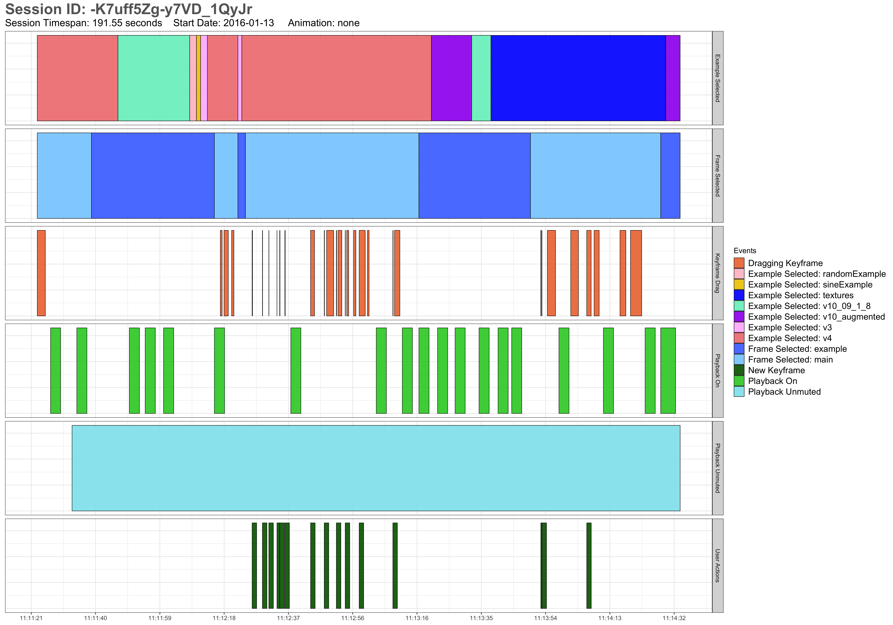

# user-activity-dashboard
An RShiny dashboard application that visualizes user activity logs for the haptic design website, [Macaron](http://hapticdesign.github.io/macaron/). The dashboard features graphs of various usage metrics; date filters can be used to adjust the timespan for the graphs. The dashboard also contains ggplot charts that display a user's sequence of interactions with the website in their session of use.

See [Dashboard_Screenshots](Dashboard_Screenshots) for screenshots of the dashboard  
See [User_Sequence_Plot_Examples](User_Sequence_Plot_Examples) for example user sequence plot charts  

